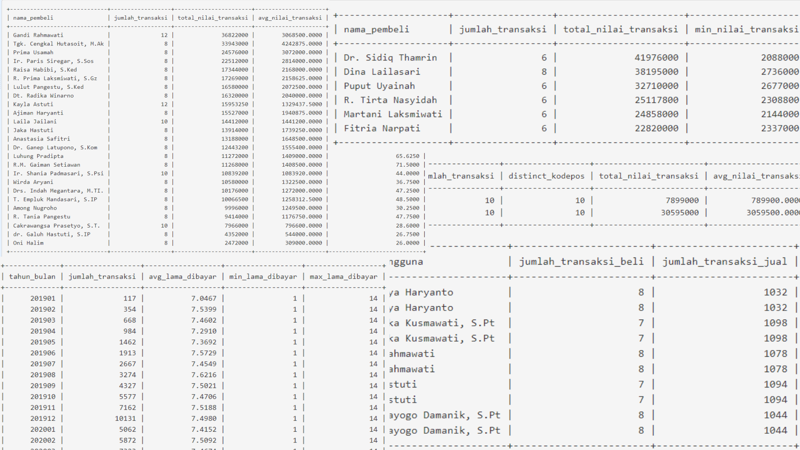

# 🛒 Ecommerce SQL Analysis Project

## 📌 Overview

This project focuses on ecommerce transaction analysis using SQL and relational datasets. The analysis explores customer purchasing behavior, reseller identification, dropshipper detection, transaction trends, and operational insights through business-oriented SQL queries.

## 🛠️ Tools & Technologies

  
  

## ⚙️ Analysis Workflow

- Relational database exploration
- Multi-table joins and aggregation
- Customer transaction analysis
- Product and category analysis
- Dropshipper and reseller detection
- Payment delay analysis
- Business insight generation

## 📊 Key Analysis Topics

| Analysis | Objective |
|---|---|
| Monthly Transaction Trends | Analyze transaction growth and revenue trends |
| Top Product Categories | Identify high-performing product categories |
| High-Value Buyers | Detect premium repeat customers |
| Dropshipper Detection | Identify customers using multiple shipping locations |
| Offline Reseller Analysis | Detect bulk buyers with repeated shipping addresses |
| Seller & Buyer Overlap | Identify users acting as both sellers and buyers |
| Payment Delay Analysis | Measure transaction payment completion delays |

## 💡 Key Insights

- High-value repeat buyers contributed significantly to platform revenue.
- Multiple shipping address patterns indicated potential dropshipper activity.
- Bulk purchases with repeated delivery locations suggested offline reseller behavior.
- Some users actively participated as both buyers and sellers within the marketplace ecosystem.
- Payment delay analysis helped evaluate operational and customer payment behavior.

## 🧠 SQL Concepts Practiced

- JOIN & Relational Modeling
- Aggregation Functions
- GROUP BY & HAVING
- DISTINCT Analysis
- Subqueries
- Customer Segmentation
- Transaction Analysis
- Date & Time Analysis

## 🌟 Project Outcome

This project strengthened practical SQL querying, analytical thinking, and business problem-solving skills through real-world ecommerce transaction analysis.

